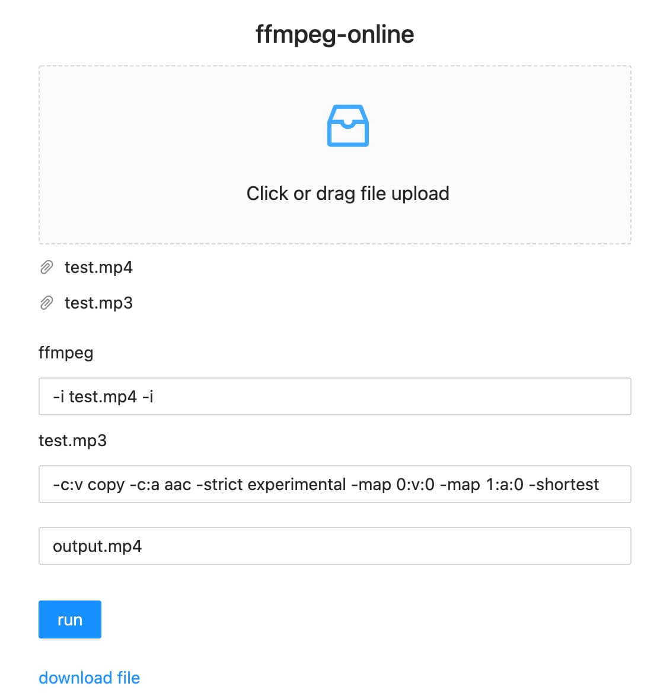

# ffmpeg-online

> https://ffmpeg-online.vercel.app/

An online version of ffmpeg based on ffmpeg.wasm, which can be used to process audio and video online

## Cut video

In ffmpeg, the command for video cropping is

```shell
ffmpeg -i test.mp4 -ss 00:00:00 -t 00:00:05 -vcodec copy -acodec copy output.mp4
```

You can upload the `test.mp4` file and run the command following the example below


## Audio and video synthesis

In ffmpeg, the command for video cropping is

```shell
ffmpeg -i test.mp4 -i test.mp3 -c:v copy -c:a aac -strict experimental -map 0:v:0 -map 1:a:0 -shortest output.mp4
```

You can upload the `test.mp4` `test.mp3` file and run the command following the example below


